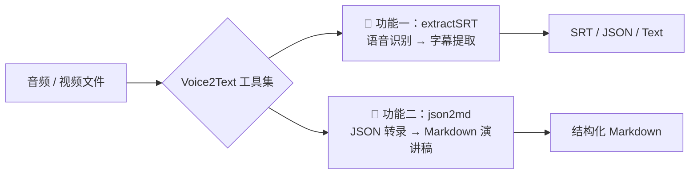
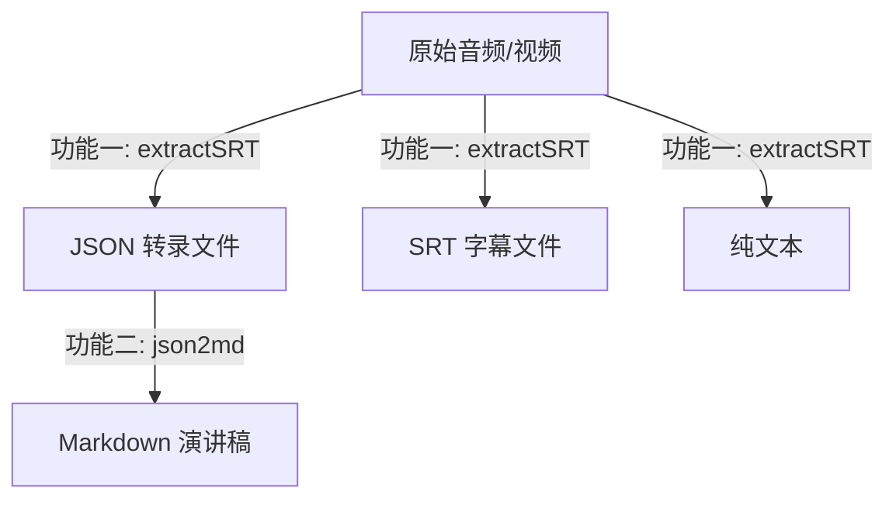

<div align="center">

**中文简体** | [English](./docs/en/README_EN.md)

</div>

---

<div align="center">

[👑 捐助本项目](https://pyvideotrans.com/about)

</div>

---

# Voice2Text — 语音识别与转录工具集

一个离线运行的本地语音处理工具集，基于 [faster-whisper](https://github.com/SYSTRAN/faster-whisper) 开源模型。提供两大核心功能：



## 功能概览

### 🎯 功能一：语音识别与字幕提取（extractSRT）

将音频/视频中的人声识别并转为文字，支持输出 **SRT 字幕**、**JSON 带时间戳**、**纯文本** 三种格式。

- 基于 faster-whisper 模型（tiny → large-v3，精度递增）
- 提供 Web UI 界面 + REST API + OpenAI 兼容接口
- 支持 CUDA 加速，准确率基本等同 OpenAI 官方 API
- 支持繁简中文自动转换

👉 **详细文档**：[extractSRT-usage.md](./docs/extractSRT-usage.md)

### 📝 功能二：JSON 转录转 Markdown 演讲稿（json2md）

将功能一导出的 JSON 转录文件，通过两阶段段落合并算法，转换为结构化的 Markdown 演讲稿。

- 两阶段合并：粗合并（按时间间隔）→ 精分段（按标点 + 长度）
- 针对口语转录中标点稀少的特点进行了优化
- 支持单文件和批量目录转换
- 可配合 CodeBuddy AI 生成内容分析报告

👉 **详细文档**：[json2md-usage.md](./docs/json2md-usage.md)

## 快速开始

### 环境要求

- Python 3.9 ~ 3.11
- FFmpeg（Windows 用户解压项目内的 `ffmpeg.zip`，Linux/Mac 自行安装）

### 安装

```bash
# 克隆项目
git clone git@github.com:jianchang512/stt.git
cd stt

# 创建虚拟环境
python -m venv venv

# 激活环境
# Windows:
%cd%/venv/scripts/activate
# Linux/Mac:
source ./venv/bin/activate

# 安装依赖
pip install -r requirements.txt

# (可选) 启用 CUDA 加速
pip uninstall -y torch
pip install torch --index-url https://download.pytorch.org/whl/cu121
```

### 使用功能一：语音识别

```bash
# 启动 Web 服务（浏览器自动打开）
python start.py

# Windows 用户也可以双击 run.bat
```

访问 `http://127.0.0.1:9977`，上传音频/视频文件即可开始识别。

### 使用功能二：JSON 转 Markdown

```bash
# 单文件转换
python tools/json2md.py Export/your-audio.json

# 批量转换
python tools/json2md.py Export/ -f
```

### 两个功能的协作流程



> 典型工作流：先用 extractSRT 将音频识别为 JSON 格式（保留时间戳），再用 json2md 将 JSON 转为可读性更好的 Markdown 演讲稿。

## 预编译 Windows 版

1. [点击此处打开 Releases 页面下载](https://github.com/jianchang512/stt/releases) 预编译文件
2. 下载后解压到某处，比如 `E:/stt`
3. 双击 `start.exe`，等待自动打开浏览器窗口即可

## 模型说明

faster-whisper 开源模型有 tiny / base / small / medium / large-v3 等多个版本，项目内置 tiny 模型。

| 模型 | 大小 | 精度 | 资源需求 |
|------|------|------|----------|
| tiny | ~75 MB | ★☆☆☆☆ | 极低 |
| base | ~145 MB | ★★☆☆☆ | 低 |
| small | ~484 MB | ★★★☆☆ | 中 |
| medium | ~1.5 GB | ★★★★☆ | 较高 |
| large-v3 | ~3 GB | ★★★★★ | 高（需 CUDA） |

[下载模型](https://github.com/jianchang512/stt/releases/tag/0.0)，解压后放到 `models/` 目录即可。

## 项目结构

```
stt-Voice2Text/
├── start.py              # Web 服务入口（功能一）
├── run.bat               # Windows 快捷启动
├── set.ini               # 全局配置文件
├── requirements.txt      # Python 依赖
├── tools/
│   └── json2md.py        # JSON→Markdown 转换工具（功能二）
├── stslib/               # 核心库
│   ├── cfg.py            # 配置解析
│   └── tool.py           # 工具函数（FFmpeg、时间转换等）
├── models/               # 模型存放目录
├── templates/            # Web UI 模板
├── static/               # 静态资源
├── Export/               # 导出文件目录
└── docs/                 # 文档
    ├── extractSRT-usage.md   # 功能一详细文档
    └── json2md-usage.md      # 功能二详细文档
```

## CUDA 加速

如果你的电脑拥有 NVIDIA 显卡，可以启用 CUDA 加速：

1. 升级显卡驱动 → 安装 [CUDA Toolkit](https://developer.nvidia.com/cuda-downloads) → 安装 [cuDNN](https://developer.nvidia.com/rdp/cudnn-archive)
2. 验证：`nvcc --version` 和 `nvidia-smi`
3. 修改 `set.ini` 中 `devtype=cpu` 为 `devtype=cuda`
4. 重启服务

> 详细安装教程：https://juejin.cn/post/7318704408727519270

## 注意事项

- 没有英伟达显卡或未配置 CUDA 环境时，不要使用 large 系列模型
- 中文在某些情况下可能输出繁体字，可通过 `set.ini` 中的 `opencc = t2s` 自动转换
- `cublasxx.dll` 缺失时，[下载 cuBLAS](https://github.com/jianchang512/stt/releases/download/0.0/cuBLAS_win.7z) 并复制到 `C:/Windows/System32`
- 控制台出现 `onnxruntime` 警告可忽略

## 相关项目

- [视频翻译配音工具](https://github.com/jianchang512/pyvideotrans) — 翻译字幕并配音
- [声音克隆工具](https://github.com/jianchang512/clone-voice) — 用任意音色合成语音
- [人声背景乐分离](https://github.com/jianchang512/vocal-separate) — 极简的人声和背景音乐分离工具

## 致谢

1. https://github.com/SYSTRAN/faster-whisper
2. https://github.com/pallets/flask
3. https://ffmpeg.org/
4. https://layui.dev
