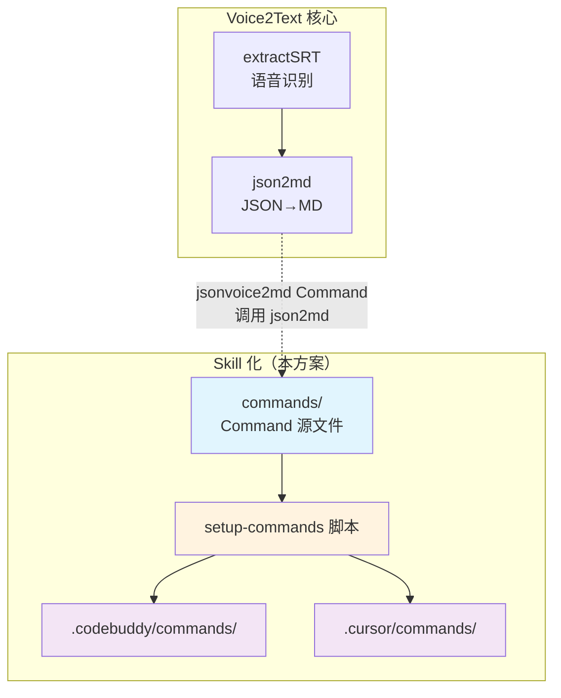
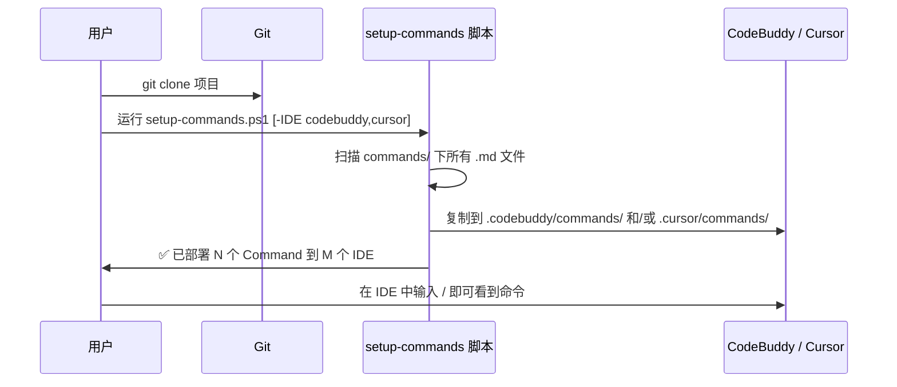
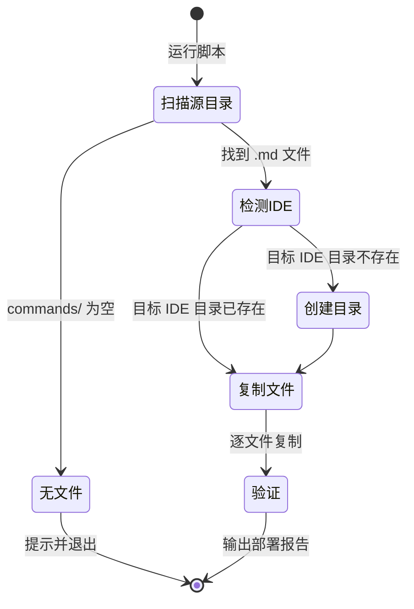

# 一、文档与上下文信息

## 1. 基础元数据

本文档记录 Voice2Text 项目 **Skill 化**（即自定义 AI Command 的可移植安装方案）的需求分析与技术预设计。

## 2. 本期核心摘要

解决自定义 AI Command（如 `jsonvoice2md`）无法跨设备、跨 IDE 共享的问题。通过仓库内自包含的一键配置脚本，实现 clone 后一条命令即可将所有 Skill 部署到 CodeBuddy / Cursor 等 IDE 中。

## 3. 上下文与依赖

| 项目 | 说明 |
|------|------|
| 前置文档 | [SYSTEM_DESIGN.MD](../docs/SYSTEM_DESIGN.MD) — 文档架构规范 |
| 依赖组件 | `.codebuddy/commands/` — CodeBuddy 命令目录 |
| 依赖组件 | `.cursor/commands/` — Cursor 命令目录 |
| 参考项目 | [github/spec-kit](https://github.com/github/spec-kit) — 规范驱动开发工具包 |
| 现有 Skill | `jsonvoice2md.md` — JSON 转录转 Markdown 演讲稿命令 |

# 二、目标与边界

## 1. 业务与功能目标

**用户痛点**：当前自定义 Command 文件存放在 `.codebuddy/commands/` 中，该目录被 `.gitignore` 忽略。导致：
- 换一台电脑 clone 项目后，Command 丢失，需要手动重新配置
- 团队成员无法共享已调优的 Command
- 不同 IDE（CodeBuddy / Cursor）需要分别手动复制

**功能目标**：
1. 自定义 Command 源文件纳入 Git 版本管理
2. clone 后一条命令即可部署到目标 IDE
3. 新增 Command 零配置 — 只需往源目录丢文件
4. 为未来更多 Skill 类型（Rules、Prompts 等）预留扩展空间

## 2. 架构目标与定位

本方案在项目全局架构中的角色是 **旁路辅助** — 不影响核心功能（extractSRT / json2md），仅服务于 AI 辅助开发体验。



## 3. 边界与非目标（约束）

| 类型 | 说明 |
|------|------|
| ❌ 不做 | 不发布为 pip/npm 包（过度工程化，ROI 太低） |
| ❌ 不做 | 不实现 CLI 工具（如 speckit 的 `specify init`），保持轻量 |
| ❌ 不做 | 本阶段不考虑 Rules / Prompts 等其他 Skill 类型的安装（仅预留目录结构） |
| ❌ 不做 | 不支持 Claude Code / Copilot 等其他 IDE（本阶段仅 CodeBuddy + Cursor） |
| ⏳ 延后 | 自动检测本机已安装的 IDE（初版通过参数指定） |

# 三、交互与产品设计

## 1. 用户使用路径



**典型场景**：

| 场景 | 操作 |
|------|------|
| 首次 clone | `.\scripts\setup-commands.ps1` |
| 指定 IDE | `.\scripts\setup-commands.ps1 -IDE cursor` |
| 多 IDE | `.\scripts\setup-commands.ps1 -IDE codebuddy,cursor` |
| 新增 Command 后 | 往 `commands/` 丢文件，重新运行脚本 |

## 2. 核心规则与状态机



**幂等性保证**：重复运行脚本，已有文件会被覆盖（以源文件为准），不会产生重复。

# 四、技术架构与关键决策

## 1. 技术栈与基础设施

| 项目 | 选型 |
|------|------|
| 脚本语言 | PowerShell（Windows 主力）+ Bash（macOS/Linux 可选） |
| 依赖 | 零外部依赖，仅使用系统内置命令 |
| 文件格式 | Markdown（`.md`），与 CodeBuddy / Cursor 命令格式一致 |

## 2. 关键信息

### 2.1 目录结构设计

```
stt-Voice2Text/
├── commands/                        # 📦 Command 源文件（Git 追踪）
│   └── jsonvoice2md.md             # 自定义 Command
├── scripts/
│   ├── setup-commands.ps1          # 🔧 Windows 一键配置
│   └── setup-commands.sh           # 🔧 macOS/Linux 一键配置（可选）
├── .codebuddy/commands/            # ← 脚本生成（.gitignore 忽略）
├── .cursor/commands/               # ← 脚本生成（.gitignore 忽略）
└── .gitignore                      # 忽略 IDE 生成目录
```

### 2.2 IDE 命令目录映射

| IDE | 命令目录 | 命令格式 |
|-----|---------|---------|
| CodeBuddy | `.codebuddy/commands/*.md` | frontmatter + Markdown |
| Cursor | `.cursor/commands/*.md` | frontmatter + Markdown |

### 2.3 .gitignore 策略

```gitignore
# IDE 生成目录（脚本自动创建，不纳入版本管理）
.codebuddy/
.cursor/

# Command 源文件在 commands/ 目录中，已纳入版本管理
```

**关键决策**：不再使用 `.gitignore` 否定规则（`!.codebuddy/commands/jsonvoice2md.md`），而是将源文件独立到 `commands/` 目录，通过脚本复制到各 IDE 目录。原因：
- 否定规则每新增一个 Command 都要手动改 `.gitignore`
- 否定规则无法解决 Cursor 等其他 IDE 的需求
- 独立源目录更清晰，职责分离

## 3. 架构决策记录 (ADR)

### ADR-001：为什么不用 speckit 的 CLI 安装方式？

| 维度 | speckit CLI | 一键脚本 |
|------|------------|---------|
| 安装依赖 | Python + uv + pip install | 零依赖 |
| 配置步骤 | `uv tool install` → `specify init` | 一条命令 |
| 新增 Command | 需改 CLI 源码重新发布 | 丢文件到 `commands/` |
| 仓库自包含 | ❌ 外部依赖 | ✅ 完全自包含 |

**结论**：speckit 的 CLI 方式适合大型工具包（9+ 命令 + 模板 + 脚本），我们只有少量 Command，一键脚本的 ROI 更高。

### ADR-002：为什么不用 .gitignore 否定规则？

| 维度 | 否定规则 | 独立源目录 + 脚本 |
|------|---------|------------------|
| 新增 Command | 需手动改 `.gitignore` | 丢文件即可 |
| 多 IDE 支持 | 每个 IDE 都要加规则 | 脚本自动处理 |
| 可读性 | 否定规则语法反直觉 | 目录结构一目了然 |
| 维护成本 | 随 Command 数量线性增长 | 恒定 |

**结论**：独立源目录 + 脚本方案在可维护性和可扩展性上全面优于否定规则。

# 五、实施与验证（任务流）

### 5.1 任务拆解清单

| Step | 任务 | 说明 |
|------|------|------|
| 1 | 创建 `commands/` 源目录 | 将 `jsonvoice2md.md` 从 `.codebuddy/commands/` 复制到 `commands/` |
| 2 | 编写 `scripts/setup-commands.ps1` | PowerShell 一键配置脚本，支持 `-IDE` 参数 |
| 3 | （可选）编写 `scripts/setup-commands.sh` | Bash 版本，macOS/Linux 支持 |
| 4 | 更新 `.gitignore` | 确保 `.codebuddy/` 和 `.cursor/` 被忽略，`commands/` 被追踪 |
| 5 | 更新 `README.md` | 添加 Skill 配置说明章节，链接到本文档和 usage |
| 6 | 编写 Skill 使用文档 | 在 `docs/` 中补充 setup-commands 的详细使用说明 |

### 5.2 验收标准

- [ ] `commands/jsonvoice2md.md` 存在且内容与当前 `.codebuddy/commands/` 版本一致
- [ ] 运行 `.\scripts\setup-commands.ps1` 后，`.codebuddy/commands/jsonvoice2md.md` 被正确创建
- [ ] 运行 `.\scripts\setup-commands.ps1 -IDE cursor` 后，`.cursor/commands/jsonvoice2md.md` 被正确创建
- [ ] 重复运行脚本不会报错（幂等性）
- [ ] 新增一个测试 `.md` 到 `commands/`，重新运行脚本后自动部署
- [ ] `README.md` 中有 Skill 配置的入口链接

# 六、README 作为 Skill 导航中心的设计

> 用户提出：README 应该像超链接一样，连接到不同 Skill 的使用方式和配置方法，自身保持宏观引导。

### 设计原则

README 定位为 **Skill 导航中心**，不堆砌细节，而是：
1. 宏观介绍项目有哪些 Skill（功能 + Command）
2. 每个 Skill 一句话说明 + 链接到详细文档
3. 快速开始章节提供最短路径

### 预期 README 结构调整

```markdown
## 🧩 AI Skill 配置（可选）

本项目提供可复用的 AI Command（Skill），支持 CodeBuddy 和 Cursor。

### 一键配置

clone 后运行以下命令即可部署所有 Skill：

​```powershell
.\scripts\setup-commands.ps1
​```

### 可用 Skill

| Skill | 说明 | 详细文档 |
|-------|------|---------|
| `/jsonvoice2md` | JSON 转录 → Markdown 演讲稿 + AI 分析 | [json2md-usage.md](./docs/json2md-usage.md) |
| （未来扩展） | ... | ... |

👉 **Skill 化设计文档**：[001-skill化.md](./dallas_doc/001-skill化.md)
```

这样 README 保持精简，每新增一个 Skill 只需在表格中加一行。
