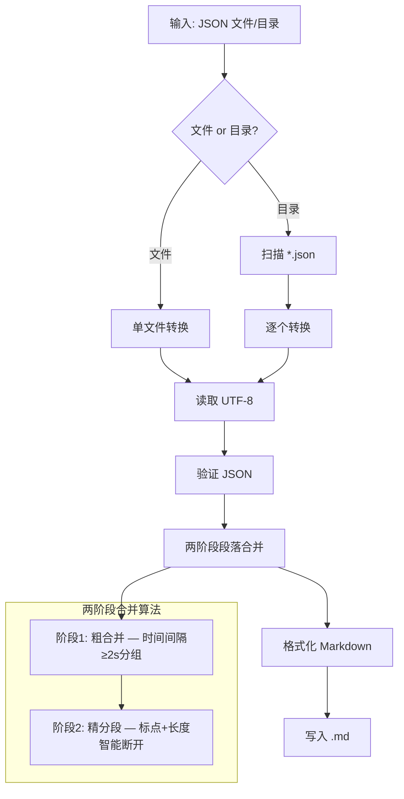

# Voice2Text 使用说明

## 一、项目概览

Voice2Text 是一套离线语音转录与内容分析工具链，核心流程：


| 组件 | 说明 | 入口 |
|------|------|------|
| **stt 服务** | 基于 faster-whisper 的离线语音识别，提供 Web UI + API | `python start.py` |
| **json2md.py** | JSON 转录 → 结构化 Markdown（两阶段段落合并） | `python tools/json2md.py` |
| **AI Commands** | IDE 内 AI 辅助命令（提取、转换、分析一条龙） | `/stt.extract`、`/stt.json2md`、`/stt.summarize` |

## 二、部署

### 2.1 环境要求

| 项目 | 要求 |
|------|------|
| Python | 3.9 ~ 3.11 |
| FFmpeg | Windows 解压项目内 `ffmpeg.zip`；Linux/Mac 自行安装 |
| 磁盘 | 模型文件 75MB ~ 3GB（按所选模型） |
| 显卡（可选） | NVIDIA + CUDA 可加速，非必须 |

### 2.2 安装步骤

```bash
# 1. 克隆项目
git clone https://github.com/jianchang512/stt.git
cd stt

# 2. 创建虚拟环境（推荐）
python -m venv venv
# Windows
.\venv\Scripts\activate
# Linux/Mac
source venv/bin/activate

# 3. 安装依赖
pip install -r requirements.txt
```

依赖清单：

```
torch==2.1.2
flask
requests
gevent
faster-whisper
fsspec
opencc-python-reimplemented
```

### 2.3 启动服务

```bash
# 方式一：命令行
python start.py

# 方式二：Windows 双击
run.bat
```

启动后浏览器自动打开 `http://127.0.0.1:9977`。

### 2.4 配置文件 (`set.ini`)

修改后需重启服务。

| 配置项 | 说明 | 默认值 |
|--------|------|--------|
| `web_address` | 监听地址 | `127.0.0.1:9977` |
| `lang` | 界面语言（`zh` / `en`） | 自动检测 |
| `devtype` | 计算设备（`cpu` / `cuda`） | `cpu` |
| `beam_size` | Beam search 宽度，降低可减少显存 | `5` |
| `best_of` | 候选数量，降低可减少显存 | `5` |
| `vad` | VAD 静音过滤 | `true` |
| `temperature` | 采样温度，`0` = 贪心解码 | `0` |
| `condition_on_previous_text` | 基于前文推理 | `false` |
| `opencc` | 繁简转换（`t2s` 繁→简 / `s2t` 简→繁） | `t2s` |
| `model_list` | 模型下拉列表 | `tiny,base,...,large-v3` |

### 2.5 CUDA 加速（可选）

1. 升级 NVIDIA 显卡驱动到最新版
2. 安装 [CUDA Toolkit](https://developer.nvidia.com/cuda-downloads)
3. 安装 [cuDNN](https://developer.nvidia.com/rdp/cudnn-archive)（需与 CUDA 版本匹配）
4. 验证：
   ```bash
   nvcc --version
   nvidia-smi
   python testcuda.py
   ```
5. 修改 `set.ini` 中 `devtype=cuda`
6. 重启服务

### 2.6 AI Command 部署

```powershell
# 一键部署到 CodeBuddy（默认）
.\scripts\setup-commands.ps1

# 部署到 Cursor
.\scripts\setup-commands.ps1 -IDE cursor

# 同时部署到两个 IDE
.\scripts\setup-commands.ps1 -IDE codebuddy,cursor
```

部署后在 IDE 中输入 `/stt.` 即可看到三个命令。

## 三、stt 语音识别服务

### 3.1 Web UI 使用

1. **上传文件** — 拖拽或点击上传（支持 wav, mp3, flac, mp4, mov, mkv, avi, mpeg）
2. **选择参数**：
   - 发音语言 — 选择语言或"自动检测"
   - 模型 — tiny → large-v3 精度递增
   - 返回格式 — SRT / JSON / 纯文本
3. **点击"立即识别"** — 等待完成
4. **导出结果**

> 所有非 WAV 格式会通过 FFmpeg 自动转换为 16kHz 单声道 WAV。

### 3.2 模型选择

| 模型 | 大小 | 适用场景 | 显存需求 |
|------|------|----------|----------|
| `tiny` | ~75 MB | 快速测试、低资源设备 | 极低 |
| `base` | ~145 MB | 日常使用、CPU 环境 | 低 |
| `small` | ~484 MB | 较高精度 | 中 |
| `medium` | ~1.5 GB | 高精度 | 较高 |
| `large-v3` | ~3 GB | 最高精度，需 CUDA | 高（≥8 GB） |
| `large-v3-turbo` | ~1.6 GB | 高精度 + 较快速度 | 较高 |

模型存放在 `models/` 目录，首次使用自动从 HuggingFace 下载。也可从 [Releases](https://github.com/jianchang512/stt/releases/tag/0.0) 手动下载。

> ⚠️ 无 NVIDIA 显卡或未配置 CUDA 时，请勿使用 large 系列模型。

### 3.3 API 接口

#### 原生 API

`POST http://127.0.0.1:9977/api`（form-data）

| 参数 | 类型 | 说明 | 必填 |
|------|------|------|------|
| `file` | file | 音频/视频文件 | ✅ |
| `language` | string | 语言代码（`zh`/`en`/`ja`/`ko` 等） | ✅ |
| `model` | string | 模型名称 | ✅ |
| `response_format` | string | `srt` / `json` / `text` | 否（默认 `srt`） |

```python
import requests

url = "http://127.0.0.1:9977/api"
files = {"file": open("audio.wav", "rb")}
data = {"language": "zh", "model": "base", "response_format": "json"}
response = requests.post(url, timeout=600, data=data, files=files)
print(response.json())
# {"code": 0, "msg": "ok", "data": [...]}
```

#### OpenAI 兼容接口

`POST http://127.0.0.1:9977/v1/audio/transcriptions`

```python
from openai import OpenAI

client = OpenAI(api_key="any-key", base_url="http://127.0.0.1:9977/v1")
audio_file = open("audio.wav", "rb")
transcription = client.audio.transcriptions.create(
    model="tiny", file=audio_file, response_format="text"
)
print(transcription.text)
```

### 3.4 输出格式

**JSON**（后续 json2md 的输入格式）：

```json
[
  {
    "line": 1,
    "start_time": "00:00:00,000",
    "end_time": "00:00:02,500",
    "text": "大家好，欢迎来到今天的分享。"
  }
]
```

**SRT 字幕**：

```srt
1
00:00:00,000 --> 00:00:02,500
大家好，欢迎来到今天的分享。
```

**纯文本**：逐行输出转录文本。

### 3.5 常用语言代码

| 语言 | 代码 | 语言 | 代码 |
|------|------|------|------|
| 中文 | `zh` | 英语 | `en` |
| 日语 | `ja` | 韩语 | `ko` |
| 法语 | `fr` | 德语 | `de` |
| 俄语 | `ru` | 西班牙语 | `es` |

## 四、json2md 转换工具

### 4.1 基本用法

```bash
# 单文件转换
python tools/json2md.py Export/your-audio.json

# 批量转换目录
python tools/json2md.py Export/

# 覆盖已有输出
python tools/json2md.py Export/your-audio.json -f
```

| 参数 | 说明 | 默认值 |
|------|------|--------|
| `input` | JSON 文件路径或目录 | （必填） |
| `-o`, `--output-dir` | 输出目录 | 与输入同目录 |
| `-f`, `--overwrite` | 覆盖已有文件 | 否（追加数字后缀） |

### 4.2 工作流程



### 4.3 段落合并算法

**阶段 1 — 粗合并**：相邻 segment 时间间隔 ≥ 2 秒 → 断开为新组。

**阶段 2 — 精分段**：

| 优先级 | 条件 | 说明 |
|--------|------|------|
| 1（最高） | ≥ 100 字符 + 句末标点（。！？） | 句末断开 |
| 2 | ≥ 100 字符 + 子句标点（，、；） | 子句断开 |
| 3 | ≥ 250 字符 | segment 边界强制断开 |

> 口语转录标点密度低（200+ 字符才有一个标点），算法会自动回退到 segment 边界断开。

### 4.4 输出格式

```markdown
# 文件名 — 演讲稿与内容分析

**Source**: 原始文件名.json
**Segments**: 695 (merged into ~39 paragraphs)
**Duration**: 00:00:00 → 00:18:30

---

## 第一章：原文

第一段合并后的文本...

第二段合并后的文本...
```

### 4.5 退出码

| 退出码 | 含义 |
|--------|------|
| `0` | 成功 |
| `1` | 批量模式下部分文件失败 |
| `2` | 致命错误（文件不存在、JSON 无效、编码错误等） |

## 五、AI Command 工作流

### 5.1 三命令串联


| 命令 | 输入 | 输出 | 说明 |
|------|------|------|------|
| `/stt.extract` | 音频/视频文件路径 | `Export/*.json` | 调用 stt API 提取转录，支持 wav/mp3/mp4/flac 等所有常见格式，自动检测/启动服务 |
| `/stt.json2md` | JSON 文件路径 | `Export/*.md`（含两章） | 调用 json2md.py + AI 重写（子标题、标点、对话检测） |
| `/stt.summarize` | MD 文件路径 | 同文件追加第三章 | AI 内容分析（主题、核心观点、可选章节） |

### 5.2 单独使用

每个命令可独立运行，不强制串联：

```
# 已有 JSON，只做转换 + 重写
/stt.json2md Export/my-audio.json

# 已有 MD，只做内容分析
/stt.summarize Export/my-audio.md
```

### 5.3 最终输出结构

完整流程后，MD 文件包含三章：

```markdown
## 第一章：原文
（json2md.py 脚本生成的合并段落）

---

## 第二章：AI 重写
（AI 生成：子标题分配、标点补充、对话性内容标注）

---

## 第三章：内容分析
（AI 生成：主题、核心观点、论据案例、行动建议等）
```

### 5.4 关键特性

| 特性 | 说明 |
|------|------|
| **幂等性** | 重复执行不产生重复内容，自动替换已有章节 |
| **渐进式加载** | 长文自动分段处理，避免 token 溢出 |
| **错误即停** | 任何步骤失败立即报告，不静默跳过 |
| **服务自动启动** | `stt.extract` 检测到服务未运行时自动启动 |

## 六、常见问题

| 问题 | 解决方案 |
|------|----------|
| 中文输出繁体字 | 检查 `set.ini` 中 `opencc = t2s` |
| `cublasxx.dll` 不存在 | 下载 [cuBLAS](https://github.com/jianchang512/stt/releases/download/0.0/cuBLAS_win.7z) 复制到 `C:/Windows/System32` |
| 启用 CUDA 后闪退 | 检查 cuDNN 安装；显存不足换小模型 |
| 模型下载失败 | 检查网络；中文环境自动使用 HuggingFace 镜像 |
| stt 服务启动超时 | 检查端口 9977 是否被占用：`netstat -ano \| findstr :9977` |
| json2md 输出为空 | 确认 JSON 文件为 stt 导出格式，包含 `line`/`start_time`/`end_time`/`text` 字段 |
| AI Command 不可见 | 运行 `.\scripts\setup-commands.ps1` 部署命令到 IDE |

## 七、项目结构速查

```
stt-Voice2Text/
├── start.py                 # stt 服务入口
├── run.bat                  # Windows 一键启动
├── set.ini                  # 服务配置
├── requirements.txt         # Python 依赖
├── tools/
│   └── json2md.py           # JSON→MD 转换工具
├── commands/                # AI Command 源文件（Git 追踪）
│   ├── stt.extract.md
│   ├── stt.json2md.md
│   └── stt.summarize.md
├── scripts/
│   └── setup-commands.ps1   # 一键部署 AI Command
├── Export/                  # 输出目录（转录 JSON + MD）
├── models/                  # whisper 模型缓存
└── dallas_doc/              # 项目设计与使用文档
```
