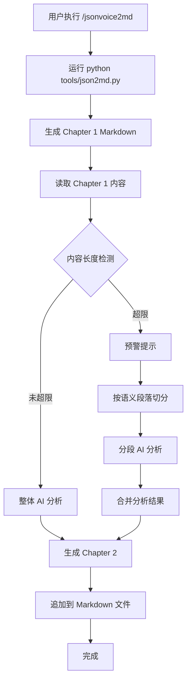

# CLI Contract: json2md.py

**Feature**: 002-json-voice-to-md
**Date**: 2026-03-31
**Updated**: 2026-03-31 (post-clarification)

## Overview

The CLI tool generates **Chapter 1 only** (rule-based article from JSON transcription). For the full two-chapter experience (article + AI analysis), use the CodeBuddy command `/jsonvoice2md`.

## Command Interface

```text
python tools/json2md.py <input> [options]
```

### Positional Arguments

| Argument | Type | Description |
|---|---|---|
| `input` | string | Path to a JSON file or directory containing JSON files |

### Optional Arguments

| Flag | Short | Type | Default | Description |
|---|---|---|---|---|
| `--output-dir` | `-o` | string | same as input | Output directory for generated Markdown files |
| `--overwrite` | `-f` | flag | false | Overwrite existing output files |

### Exit Codes

| Code | Meaning |
|---|---|
| 0 | Success (all files converted) |
| 1 | Partial failure (some files failed in batch mode) |
| 2 | Fatal error (invalid input, missing file, etc.) |

## Usage Examples

### Single file → Article
```bash
python tools/json2md.py Export/audio.json
# Output: Export/audio.md (Chapter 1: merged article)
```

### Batch conversion
```bash
python tools/json2md.py Export/
# Output: Export/*.md (one article per JSON file)
```

### Custom output directory
```bash
python tools/json2md.py Export/audio.json -o output/
# Output: output/audio.md
```

### Overwrite existing
```bash
python tools/json2md.py Export/audio.json -f
# Overwrites Export/audio.md if it exists
```

## Output Format (Chapter 1 Only)

```markdown
# 为什么你的Agent总翻车？Harness Engineering全拆解：Ant — 演讲稿与内容分析

**Source**: 为什么你的Agent总翻车？Harness Engineering全拆解：Ant.json
**Segments**: 695 (merged into ~80 paragraphs)
**Duration**: 00:00:00 → 00:22:28

---

## 第一章：原文

大家好,今天我们聊一个2026年上半年AI工程圈里升温速度最快的概念,Hardness Engineering。先说结论,如果你现在还停留在怎么写一条更好的prompt这个层面去做agent,那今天这集视频你一定要看完。

因为prompt只是冰山一角,真正决定你的agent能不能在生产环境里稳定运行的,是一整套叫做Hardness Engineering的工程方法论。它不是一个新框架,也不是一个新模型,而是一种系统性的思维方式。

...
```

> **Note**: Chapter 2 (内容分析) is appended by the CodeBuddy command using IDE AI, not by this CLI tool.

## CodeBuddy Command Contract

The `/jsonvoice2md` command orchestrates the full workflow:

```text
/jsonvoice2md <json-file-path>
```

### Workflow



### Re-execution Behavior

When `/jsonvoice2md` is executed on a file that already contains Chapter 2 (`## 第二章：内容分析`), the command detects the existing heading and **replaces** the entire Chapter 2 section (from the heading to end-of-file) with the newly generated analysis. This ensures idempotent behavior — running the command twice produces the same result as running it once.

### Chapter 2 Output Structure

```markdown
---

## 第二章：内容分析

### 主题
Harness Engineering 是一种系统性的 AI Agent 工程方法论，超越了单纯的 prompt 优化层面。

### 核心观点
1. Prompt Engineering 只是冰山一角，真正决定 Agent 稳定性的是 Harness Engineering
2. Harness Engineering 包含上下文管理、工具编排、错误恢复等系统性工程实践
3. ...

### 概念解释
- **Harness Engineering**: 一种系统性的 AI Agent 工程方法论...
- **Context Engineering**: 上下文工程，管理 Agent 的信息输入...

### 行动建议
1. 从 Prompt Engineering 思维升级到 Harness Engineering 思维
2. ...
```

## Error Messages

| Scenario | Message | Exit Code |
|---|---|---|
| File not found | `Error: File not found: {path}` | 2 |
| Invalid JSON | `Error: Invalid JSON in {path}: {detail}` | 2 |
| Not stt export | `Error: {path} is not a valid stt JSON export (missing required fields)` | 2 |
| Encoding error | `Error: {path} contains invalid UTF-8 encoding` | 2 |
| Output exists | `Warning: {path} already exists, skipping (use --overwrite to replace)` | 0 |
| Batch partial fail | `Completed with errors: {n}/{total} files failed` | 1 |
