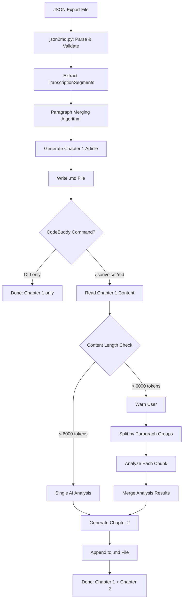
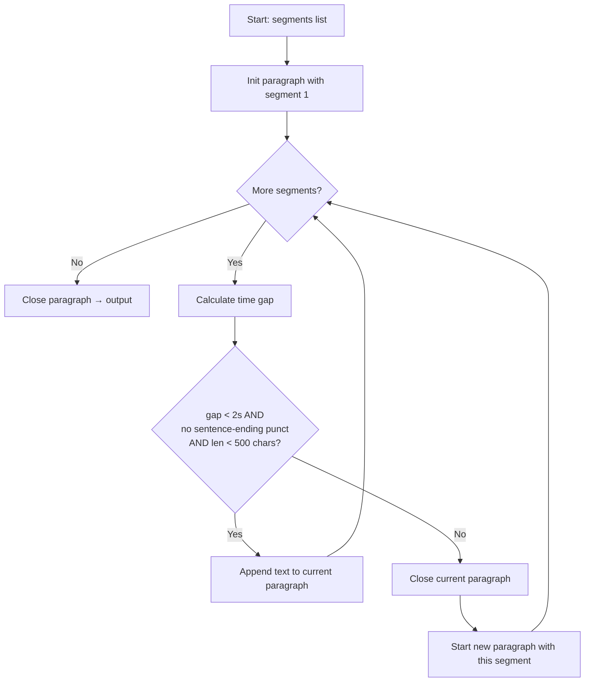

# Implementation Plan: JSON Voice Transcription to Markdown Article & Analysis

**Branch**: `002-json-voice-to-md` | **Date**: 2026-03-31 | **Spec**: [spec.md](./spec.md)
**Input**: Feature specification from `/specs/002-json-voice-to-md/spec.md`
**Clarifications**: [clarifications.md](./clarifications.md) — 5 questions resolved, major scope change

## Summary

Convert stt JSON transcription exports into a two-chapter Markdown document:
- **Chapter 1 (原文)**: Rule-based paragraph merging transforms fragmented subtitle segments into a coherent, publishable article
- **Chapter 2 (内容分析)**: AI-powered content analysis via CodeBuddy command generates a dynamic summary with mandatory (主题 + 核心观点) and optional sections

Two-component architecture: standalone Python CLI (`tools/json2md.py`) for Chapter 1 + CodeBuddy command (`.codebuddy/commands/jsonvoice2md.md`) for the full workflow including Chapter 2.

## Technical Context

**Language/Version**: Python 3.9–3.11 (matching upstream requirement)
**Primary Dependencies**: Python standard library only (json, argparse, re, pathlib, os) — zero external dependencies
**Storage**: File-based (JSON input → Markdown output)
**Testing**: Manual smoke test (no automated test framework in upstream project)
**Target Platform**: Windows (primary), cross-platform compatible
**Project Type**: CLI tool + IDE AI command (two-component)
**Performance Goals**: Chapter 1 generation < 5 seconds for 1-hour transcription (~2000 segments)
**Constraints**: Chapter 1 fully offline; Chapter 2 requires CodeBuddy IDE AI; token limit handling for long content
**Scale/Scope**: Single-user local tool; typical input 50–2000 segments (5min–2hr recordings)

## Constitution Check (Pre-Design)

*GATE: Must pass before Phase 0 research.*

| # | Principle | Status | Assessment |
|---|---|---|---|
| I | **Upstream Isolation** | ✅ PASS | All new files: `tools/json2md.py` (new), `.codebuddy/commands/jsonvoice2md.md` (new). Zero modifications to upstream files. Feature branch `002-json-voice-to-md`. |
| II | **Minimal Diff Footprint** | ✅ PASS | Extension-only approach: 2 new files added, 0 existing files modified. No changes to `set.ini`, `requirements.txt`, or any upstream module. |
| III | **Backward Compatibility** | ✅ PASS | No API endpoints affected. No CLI changes to `start.py`. No existing behavior modified. New tool is purely additive. |
| IV | **Code Quality & Readability** | ✅ PASS | English variable/function names planned. Docstrings for all functions. No hardcoded paths (uses argparse). Uses Python `logging` module. |
| V | **Test Before Merge** | ✅ PASS | Manual smoke test: run `json2md.py` on sample Export JSON, verify Chapter 1 output. Run `/jsonvoice2md` command, verify Chapter 2 generation. |

**Gate Result**: ✅ ALL PASS — Proceed to Phase 0.

## Project Structure

### Documentation (this feature)

```text
specs/002-json-voice-to-md/
├── plan.md              # This file
├── spec.md              # Feature specification (post-clarification)
├── clarifications.md    # 5 Q&A from speckit.clarify
├── research.md          # Phase 0: technical research & decisions
├── data-model.md        # Phase 1: entity definitions
├── quickstart.md        # Phase 1: usage guide
├── contracts/
│   └── cli-contract.md  # Phase 1: CLI & command interface contract
└── tasks.md             # Phase 2: development tasks (via /speckit.tasks)
```

### Source Code (repository root)

```text
tools/
└── json2md.py           # Component 1: Python CLI for Chapter 1 generation
                         #   - JSON parsing & validation
                         #   - Paragraph merging algorithm
                         #   - Markdown article formatting
                         #   - Batch processing support

.codebuddy/
└── commands/
    └── jsonvoice2md.md  # Component 2: CodeBuddy AI command
                         #   - Orchestrates full workflow
                         #   - Invokes json2md.py for Chapter 1
                         #   - AI analysis prompt for Chapter 2
                         #   - Long content detection & splitting
```

**Structure Decision**: Two-file extension approach. `tools/` directory is a new addition to the repo (no upstream `tools/` exists). `.codebuddy/commands/` follows the IDE's command convention. Both are purely additive — zero upstream file modifications.

## Phase 0: Research (Complete)

All research tasks resolved in [research.md](./research.md). Key decisions:

| # | Research Task | Decision | Reference |
|---|---|---|---|
| R1 | JSON Export Schema | Flat array of `{line, start_time, end_time, text}` | research.md §R1 |
| R2 | Paragraph Merging Algorithm | 2-second gap + punctuation detection, default behavior | research.md §R2 |
| R3 | Output Structure | Two-chapter: H2 原文 + H2 内容分析 | research.md §R3 |
| R4 | Architecture | Python CLI + CodeBuddy command | research.md §R4 |
| R5 | Long Content Splitting | Semantic paragraph grouping + warning | research.md §R5 |
| R6 | Chapter 2 Prompt Design | 必选项(主题+观点) + 可选项池 | research.md §R6 |

**No NEEDS CLARIFICATION items remain.**

## Phase 1: Design & Contracts (Complete)

All design artifacts generated and verified:

| Artifact | Path | Content |
|---|---|---|
| Data Model | [data-model.md](./data-model.md) | 7 entities: TranscriptionSegment, TranscriptionExport, Paragraph, MarkdownArticleDocument, Chapter2Analysis, ContentChunk, ConversionOptions |
| CLI Contract | [contracts/cli-contract.md](./contracts/cli-contract.md) | CLI interface (`json2md.py`) + CodeBuddy command contract (`/jsonvoice2md`) with workflow diagram |
| Quickstart | [quickstart.md](./quickstart.md) | Two usage paths: Option A (full) + Option B (CLI only), example output, long content handling |

### Data Flow Pipeline



### Paragraph Merging Algorithm



## Constitution Check (Post-Design)

*Re-evaluation after Phase 1 design completion.*

| # | Principle | Status | Assessment |
|---|---|---|---|
| I | **Upstream Isolation** | ✅ PASS | Design confirmed: only 2 new files (`tools/json2md.py`, `.codebuddy/commands/jsonvoice2md.md`). No upstream file modifications. All work on feature branch. |
| II | **Minimal Diff Footprint** | ✅ PASS | Minimal footprint: 2 new files, ~300 LOC estimated. No dependency additions. No config file changes. |
| III | **Backward Compatibility** | ✅ PASS | No existing API/CLI/behavior changes. `python start.py` unaffected. `/api` and `/v1` endpoints untouched. |
| IV | **Code Quality & Readability** | ✅ PASS | Design specifies: English identifiers, docstrings, argparse (no hardcoded paths), logging module. |
| V | **Test Before Merge** | ✅ PASS | Test plan: (1) Run `json2md.py` on sample JSON → verify Chapter 1 article quality. (2) Run `/jsonvoice2md` → verify Chapter 2 analysis. (3) Test batch mode on Export/ directory. |

**Gate Result**: ✅ ALL PASS — No violations. Complexity Tracking table not needed.

## Generated Artifacts Summary

| File | Status | Description |
|---|---|---|
| `plan.md` | ✅ Generated | This implementation plan |
| `clarifications.md` | ✅ Generated | 5 clarification Q&As with impact analysis |
| `research.md` | ✅ Updated | 6 research tasks, all resolved |
| `data-model.md` | ✅ Updated | 7 entities with relationships and state diagram |
| `contracts/cli-contract.md` | ✅ Updated | CLI + CodeBuddy command contracts with workflow |
| `quickstart.md` | ✅ Updated | Two usage paths with examples |
