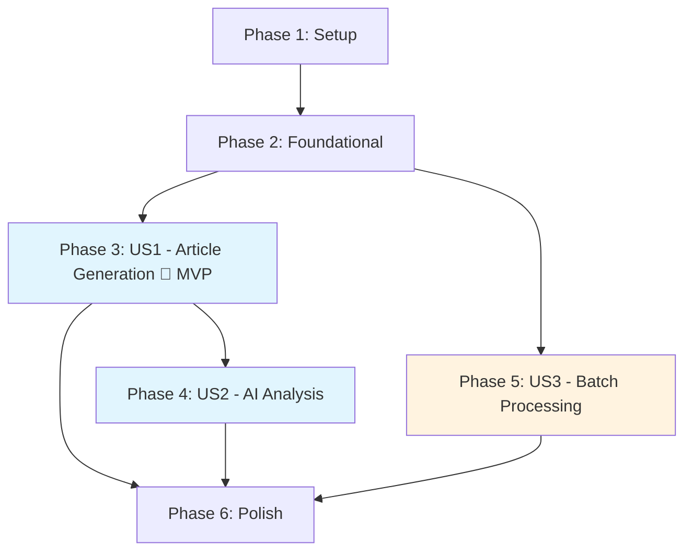

# Tasks: JSON Voice Transcription to Markdown Article & Analysis

**Input**: Design documents from `/specs/002-json-voice-to-md/`
**Prerequisites**: plan.md ✅, spec.md ✅, research.md ✅, data-model.md ✅, contracts/ ✅, quickstart.md ✅

**Tests**: Not explicitly requested in feature specification. Manual smoke tests only (per plan.md).

**Organization**: Tasks grouped by user story. US1 and US2 are both P1 but US2 depends on US1's output. US3 (P2) extends US1 with batch processing.

## Format: `[ID] [P?] [Story] Description`

- **[P]**: Can run in parallel (different files, no dependencies)
- **[Story]**: Which user story this task belongs to (US1, US2, US3)
- Exact file paths included in all descriptions

---

## Phase 1: Setup (Shared Infrastructure)

**Purpose**: Create project directories and establish the two-component file structure

- [x] T001 Create `tools/` directory at repository root for Python CLI scripts
- [x] T002 [P] Create `.codebuddy/commands/` directory at repository root for IDE AI commands
- [x] T003 [P] Create empty `tools/json2md.py` with module docstring, `#!/usr/bin/env python3` shebang, and `if __name__ == "__main__"` entry point
- [x] T004 [P] Create empty `.codebuddy/commands/jsonvoice2md.md` with front-matter placeholder

**Checkpoint**: Directory structure and empty files in place. Both components ready for implementation.

---

## Phase 2: Foundational (Blocking Prerequisites)

**Purpose**: Core utilities shared by all user stories — timestamp parsing, JSON validation, logging setup

**⚠️ CRITICAL**: US1/US2/US3 all depend on these utilities being complete

- [x] T005 Implement SRT timestamp parser (`parse_srt_time`) in `tools/json2md.py` — converts `HH:MM:SS,mmm` string to seconds (float). Used by merging algorithm to calculate time gaps. Ref: research.md §R1, data-model.md TranscriptionSegment.
- [x] T006 Implement JSON validation function (`validate_stt_export`) in `tools/json2md.py` — validates input is a JSON array where each element has `line` (int), `start_time` (str), `end_time` (str), `text` (str). Returns parsed list or raises descriptive error. Ref: data-model.md TranscriptionExport validation rules, FR-007.
- [x] T007 [P] Implement UTF-8 encoding validation in `tools/json2md.py` — file read with `encoding='utf-8'` and `errors='strict'`, catch `UnicodeDecodeError`, output error message per cli-contract.md ("Error: {path} contains invalid UTF-8 encoding"), exit code 2. Ref: FR-017.
- [x] T008 [P] Setup `logging` module configuration in `tools/json2md.py` — configure root logger with INFO level, format: `%(levelname)s: %(message)s`. Use `logging.info()` for progress, `logging.error()` for failures. Ref: plan.md Code Quality principle.
- [x] T009 Implement `argparse` CLI interface in `tools/json2md.py` — positional `input` (file or directory path), `--output-dir` / `-o` (string, default: same as input), `--overwrite` / `-f` (flag, default: false). Ref: cli-contract.md Command Interface.

**Checkpoint**: Foundation ready — JSON can be loaded, validated, and timestamps parsed. CLI accepts arguments.

---

## Phase 3: User Story 1 — Generate Article from JSON Transcription (Priority: P1) 🎯 MVP

**Goal**: Convert a single JSON transcription export into a Markdown article (Chapter 1) with coherent paragraphs merged from fragmented subtitle segments.

**Independent Test**: Run `python tools/json2md.py Export/为什么你的Agent总翻车？Harness Engineering全拆解：Ant.json` and verify the output `.md` file contains all 695 segments merged into ~50-120 natural paragraphs with metadata header.

### Implementation for User Story 1

- [x] T010 [US1] Implement paragraph merging algorithm (`merge_segments`) in `tools/json2md.py` — iterate segments, merge when: (1) time gap < 2 seconds AND (2) current paragraph doesn't end with sentence-ending punctuation `。！？.!?` AND (3) current paragraph length < 500 characters. Return list of Paragraph objects (text, start_time, end_time, segment_count). Ref: research.md §R2, FR-004, data-model.md Paragraph entity.
- [x] T011 [US1] Implement Markdown formatting function (`format_article`) in `tools/json2md.py` — generate complete Chapter 1 document: H1 title (`{filename} — 演讲稿与内容分析`), metadata block (Source, Segments count with merged paragraph count, Duration range), `---` separator, H2 `第一章：原文`, paragraphs separated by blank lines. Ref: research.md §R3, cli-contract.md Output Format, data-model.md MarkdownArticleDocument.
- [x] T012 [US1] Implement output file writing with conflict resolution in `tools/json2md.py` — write formatted Markdown to `{input_stem}.md`. If file exists and `--overwrite` not set: append numeric suffix `_1`, `_2`, etc. (FR-010). If `--overwrite` set: overwrite directly. Log output path. Ref: cli-contract.md exit codes.
- [x] T013 [US1] Implement single-file conversion orchestrator (`convert_single`) in `tools/json2md.py` — wire together: read file (UTF-8) → validate JSON → merge segments → format article → write output. Handle errors with appropriate exit codes (0=success, 2=fatal). Log progress. Ref: cli-contract.md Error Messages table.
- [x] T014 [US1] Wire `main()` function for single-file mode in `tools/json2md.py` — detect if `input` is a file path, call `convert_single()`, handle exit codes. Ref: cli-contract.md single file example.

**Checkpoint**: `python tools/json2md.py Export/audio.json` produces a complete Chapter 1 Markdown article. User Story 1 is fully functional and independently testable.

---

## Phase 4: User Story 2 — AI-Powered Content Analysis & Summary (Priority: P1)

**Goal**: Create a CodeBuddy command that orchestrates the full workflow — generates Chapter 1 via the Python script, then uses IDE AI to analyze the content and generate Chapter 2 (主题 + 核心观点 + dynamic sections).

**Independent Test**: Run `/jsonvoice2md Export/audio.json` in CodeBuddy IDE and verify the output `.md` file contains both Chapter 1 (article) and Chapter 2 (analysis with at minimum 主题, 核心观点, and one dynamic section).

### Implementation for User Story 2

- [x] T015 [US2] Create CodeBuddy command file `.codebuddy/commands/jsonvoice2md.md` with front-matter (name, description, arguments) and Step 1: instruct CodeBuddy to run `python tools/json2md.py <json-file-path>` to generate Chapter 1. Ref: cli-contract.md CodeBuddy Command Contract, research.md §R4.
- [x] T016 [US2] Add Step 2 to `.codebuddy/commands/jsonvoice2md.md` — instruct CodeBuddy to read the generated Chapter 1 content from the `.md` file and estimate token count (1 Chinese char ≈ 1.5 tokens, threshold: 6000 tokens). Ref: research.md §R5.
- [x] T017 [US2] Add Step 3 (normal path) to `.codebuddy/commands/jsonvoice2md.md` — when content ≤ 6000 tokens, include the full AI analysis prompt (必选: 主题 + 核心观点; 可选池: 论据与案例, 关键数据, 争议与反思, 行动建议, 关键引用, 概念解释, 时间线/流程). Instruct AI to generate Chapter 2 in `### ` H3 format. Ref: research.md §R6, FR-012/FR-013/FR-016.
- [x] T018 [US2] Add Step 3 (long content path) to `.codebuddy/commands/jsonvoice2md.md` — when content > 6000 tokens: display informational warning "内容较长（约 N 字），将分 M 段进行分析", split by semantic paragraph groups (never mid-paragraph), analyze each chunk with context "这是第 X/M 段内容", merge results into unified Chapter 2. Ref: research.md §R5, FR-014/FR-015, SC-005.
- [x] T019 [US2] Add Step 4 (append/replace) to `.codebuddy/commands/jsonvoice2md.md` — instruct CodeBuddy to append Chapter 2 (`---` separator + `## 第二章：内容分析` + analysis content) to the Markdown file. If `## 第二章：内容分析` already exists, replace from that heading to EOF (idempotent re-execution). Ref: FR-018, cli-contract.md Re-execution Behavior.

**Checkpoint**: `/jsonvoice2md Export/audio.json` produces a complete two-chapter Markdown document. Chapter 2 contains 主题, 核心观点, and at least one dynamic section. Re-running produces the same result (idempotent).

---

## Phase 5: User Story 3 — Batch Convert Multiple JSON Files (Priority: P2)

**Goal**: Enable batch processing — accept a directory path and convert all JSON files within it to Markdown articles (Chapter 1 only). Continue on individual file failures and report summary.

**Independent Test**: Create a directory with 3+ JSON files (including one invalid file), run `python tools/json2md.py <directory>/`, verify each valid JSON produces a `.md` file, the invalid one is skipped with error, and the summary reports the failure.

### Implementation for User Story 3

- [x] T020 [US3] Implement batch conversion function (`convert_batch`) in `tools/json2md.py` — scan directory for `*.json` files (non-recursive per FR-008), iterate and call `convert_single()` for each, track success/failure counts, log progress per file (`Converting {n}/{total}: {filename}`). Ref: FR-008, SC-006.
- [x] T021 [US3] Implement batch error handling and summary reporting in `tools/json2md.py` — on individual file failure: log error and continue (FR-008 acceptance scenario 2). After all files: log summary "Converted {success}/{total} files". If any failures: log "Completed with errors: {n}/{total} files failed" and exit code 1. Ref: cli-contract.md exit code 1, Error Messages "Batch partial fail".
- [x] T022 [US3] Wire `main()` function for directory mode in `tools/json2md.py` — detect if `input` is a directory path, call `convert_batch()`, handle exit codes. Ref: cli-contract.md batch conversion example.

**Checkpoint**: `python tools/json2md.py Export/` converts all JSON files in the directory, skips failures, and reports summary. Batch conversion of 50 files completes without manual intervention (SC-006).

---

## Phase 6: Polish & Cross-Cutting Concerns

**Purpose**: Final quality improvements across all components

- [x] T023 [P] Add `--help` documentation to argparse in `tools/json2md.py` — include usage examples matching cli-contract.md, describe all options with defaults. Ref: SC-007 (first-attempt usability).
- [x] T024 [P] Add comprehensive docstrings to all functions in `tools/json2md.py` — module docstring, function docstrings with Args/Returns/Raises, inline comments for merging algorithm logic. Ref: plan.md Code Quality principle.
- [x] T025 Run quickstart.md validation — execute all examples from quickstart.md (single file, batch, CodeBuddy command) and verify outputs match expected format. Ref: quickstart.md.
- [x] T026 Manual smoke test with sample data — run `python tools/json2md.py Export/为什么你的Agent总翻车？Harness Engineering全拆解：Ant.json` (695 segments), verify: (1) Chapter 1 has ~50-120 paragraphs, (2) all text preserved (SC-003), (3) completes in < 5 seconds (SC-001), (4) output reads as natural article (SC-002).

---

## Dependencies & Execution Order

### Phase Dependencies



- **Setup (Phase 1)**: No dependencies — start immediately
- **Foundational (Phase 2)**: Depends on Setup — BLOCKS all user stories
- **US1 (Phase 3)**: Depends on Foundational — core MVP
- **US2 (Phase 4)**: Depends on US1 (needs Chapter 1 output to analyze)
- **US3 (Phase 5)**: Depends on Foundational only (reuses `convert_single` from US1, but can be developed after US1)
- **Polish (Phase 6)**: Depends on all user stories being complete

### User Story Dependencies

- **US1 (P1)**: Can start after Foundational (Phase 2) — No dependencies on other stories
- **US2 (P1)**: Depends on US1 being complete (needs `json2md.py` to generate Chapter 1)
- **US3 (P2)**: Depends on US1's `convert_single()` function — can start after T013 is complete

### Within Each User Story

- Core algorithm before formatting
- Formatting before file I/O
- File I/O before orchestration
- Orchestration before main() wiring

### Parallel Opportunities

**Phase 1** (all parallel):
```
T001 + T002 + T003 + T004 — all create independent files/directories
```

**Phase 2** (partial parallel):
```
T005 → T006 (validation needs timestamp parser for time range checks)
T007 + T008 — independent utilities, parallel with each other
T009 — depends on T005-T008 being complete (CLI wires everything)
```

**Phase 3 US1** (sequential — single file, each step builds on previous):
```
T010 → T011 → T012 → T013 → T014
```

**Phase 4 US2** (sequential — single file, each step builds on previous):
```
T015 → T016 → T017 → T018 → T019
```

**Phase 5 US3** (sequential — single file):
```
T020 → T021 → T022
```

**Phase 6** (partial parallel):
```
T023 + T024 — independent documentation tasks
T025 → T026 — validation before smoke test
```

---

## Implementation Strategy

### MVP First (User Story 1 Only)

1. Complete Phase 1: Setup (T001-T004)
2. Complete Phase 2: Foundational (T005-T009)
3. Complete Phase 3: User Story 1 (T010-T014)
4. **STOP and VALIDATE**: Run `python tools/json2md.py Export/audio.json` — verify Chapter 1 article quality
5. ✅ MVP delivered — users can generate articles from JSON transcriptions

### Incremental Delivery

1. **Setup + Foundational** → Foundation ready
2. **Add US1** → Test independently → **MVP!** (single-file article generation)
3. **Add US2** → Test independently → Full two-chapter experience via CodeBuddy
4. **Add US3** → Test independently → Batch processing for power users
5. **Polish** → Documentation, smoke tests, quality validation
6. Each story adds value without breaking previous stories

### Single Developer Strategy (Recommended)

Since this is a two-file project (~300 LOC total), sequential execution is most practical:

1. Phase 1 → Phase 2 → Phase 3 (US1) → **Validate MVP**
2. Phase 4 (US2) → **Validate full workflow**
3. Phase 5 (US3) → **Validate batch mode**
4. Phase 6 → **Final validation**

---

## Notes

- **No external dependencies**: Python stdlib only — no `pip install` needed
- **Two files total**: `tools/json2md.py` (~250 LOC) + `.codebuddy/commands/jsonvoice2md.md` (~50 lines)
- **Zero upstream modifications**: All tasks create new files only
- **Tests are manual**: No automated test framework — use smoke tests per quickstart.md
- Commit after each task or logical group
- Stop at any checkpoint to validate story independently
