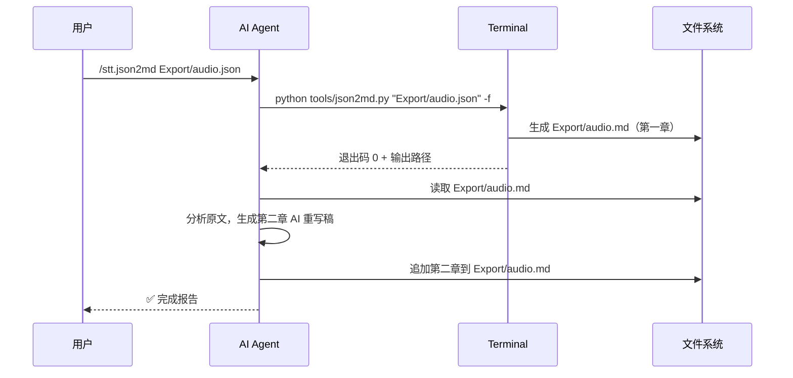
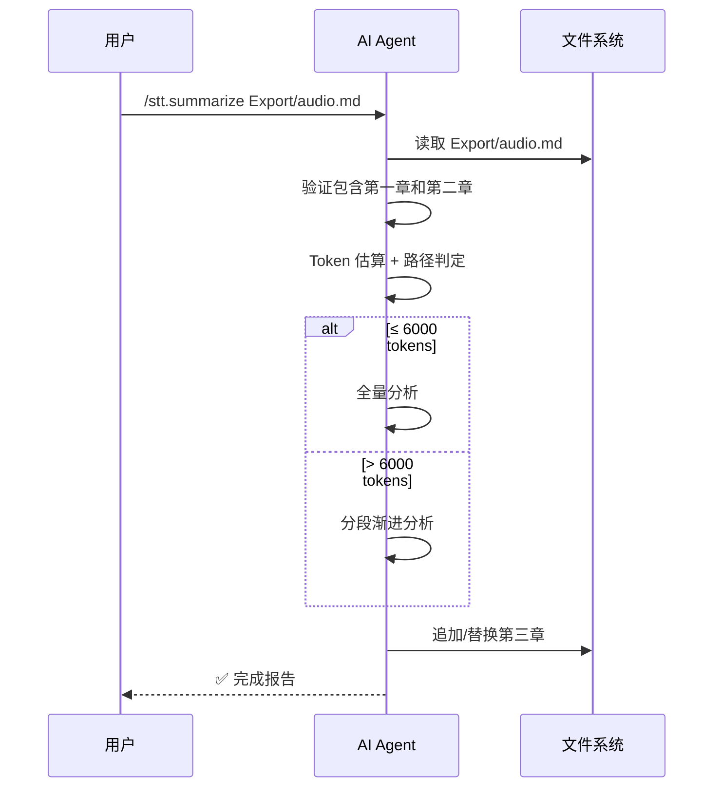
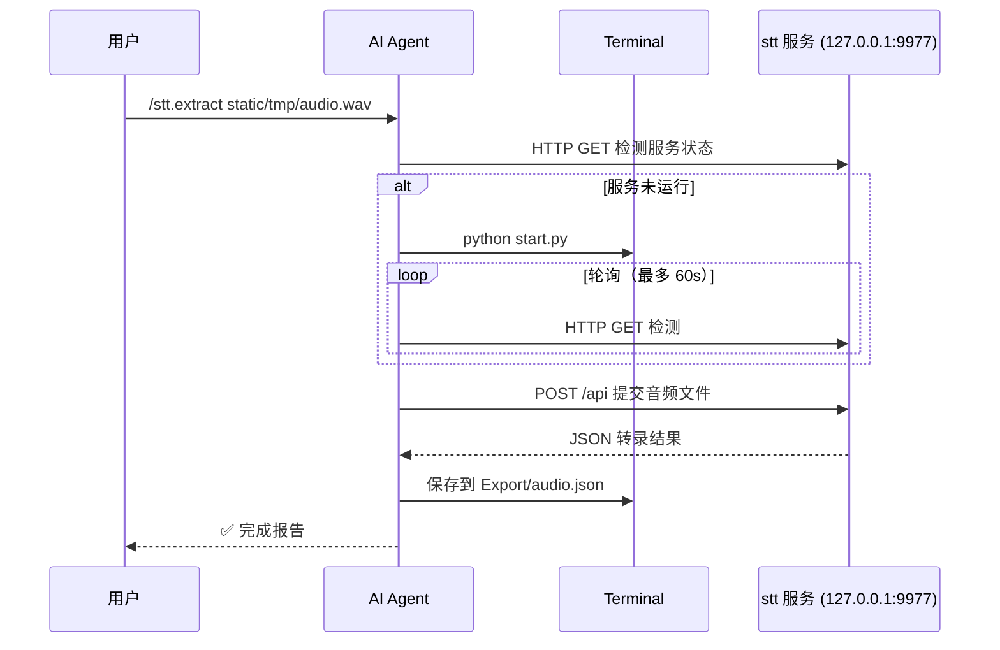

# Command Contract: stt.json2md

**Type**: AI Command (Markdown-driven)
**Trigger**: `/stt.json2md`

## Frontmatter Schema

```yaml
---
description: string  # 命令描述（中文）
arguments:
  - name: json-file-path
    description: string  # 参数描述
    required: true
---
```

## Input

| Parameter | Type | Required | Description |
|-----------|------|----------|-------------|
| json-file-path | string | ✅ | JSON 转录导出文件的路径（相对或绝对） |

## Execution Flow



## Output

**文件**: `Export/{stem}.md`

**结构**:
- `## 第一章：原文` — json2md.py 脚本生成
- `## 第二章：AI 重写` — AI 自动追加
  - `###` 三级子标题（内容概括式，不带编号）
  - 对话性内容使用 `>` 引用块标注
  - 补充标点符号，重新分段

## Error Codes

| Condition | Action |
|-----------|--------|
| JSON 文件不存在 | ABORT + 错误提示 |
| JSON 格式无效 | ABORT + 错误提示 |
| json2md.py 退出码 ≠ 0 | ABORT + 错误提示 |
| 输出 MD 为空 | ABORT + 错误提示 |

## Idempotency

- 重复执行覆盖已有文件（`-f` 标志）
- 已存在 `## 第二章：AI 重写` 时，删除后重新生成

---

# Command Contract: stt.summarize

**Type**: AI Command (Markdown-driven)
**Trigger**: `/stt.summarize`

## Frontmatter Schema

```yaml
---
description: string  # 命令描述（中文）
arguments:
  - name: md-file-path
    description: string  # 参数描述
    required: true
---
```

## Input

| Parameter | Type | Required | Description |
|-----------|------|----------|-------------|
| md-file-path | string | ✅ | 已生成的 Markdown 演讲稿文件路径 |

## Execution Flow



## Output

**追加到现有文件**: `## 第三章：内容分析`

**必选章节**: 主题、核心观点
**可选章节**: 论据与案例、关键数据、争议与反思、行动建议、关键引用、概念解释、时间线/流程

## Error Codes

| Condition | Action |
|-----------|--------|
| 文件不存在 | ABORT + 错误提示 |
| 缺少第一章或第二章标题 | ABORT + 提示先运行 /stt.json2md |
| 正文为空 | ABORT + 错误提示 |

## Idempotency

- 已存在 `## 第三章：内容分析` 时，删除后重新生成

---

# Command Contract: stt.extract

**Type**: AI Command (Markdown-driven)
**Trigger**: `/stt.extract`

## Frontmatter Schema

```yaml
---
description: string  # 命令描述（中文）
arguments:
  - name: audio-file-path
    description: string  # 参数描述
    required: true
---
```

## Input

| Parameter | Type | Required | Description |
|-----------|------|----------|-------------|
| audio-file-path | string | ✅ | wav 音频文件路径 |

## Execution Flow



## Output

**文件**: `Export/{stem}.json`

## Error Codes

| Condition | Action |
|-----------|--------|
| 音频文件不存在 | ABORT + 错误提示 |
| 非 wav 格式 | 提示通过 Web UI 转换 |
| 服务启动失败 | 降级提示 + 手动修复步骤 |
| 服务超时（60s） | ABORT + 提示检查日志 |
| API 返回错误 | ABORT + 显示错误详情 |

---

# Script Contract: setup-commands.ps1

**Type**: PowerShell Script
**Path**: `scripts/setup-commands.ps1`

## Parameters

| Parameter | Type | Required | Default | Description |
|-----------|------|----------|---------|-------------|
| -IDE | string | ❌ | codebuddy | 目标 IDE（codebuddy / cursor / 逗号分隔多选） |

## Execution Flow

```
1. 扫描 commands/*.md
2. 空目录 → 提示退出
3. 解析 -IDE 参数
4. 对每个 IDE: 创建目录 + 复制文件
5. 输出部署报告
```

## Exit Codes

| Code | Meaning |
|------|---------|
| 0 | 成功（含 commands/ 目录为空时的提示退出） |
