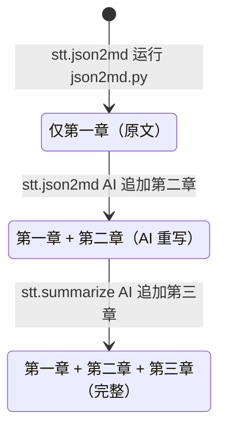
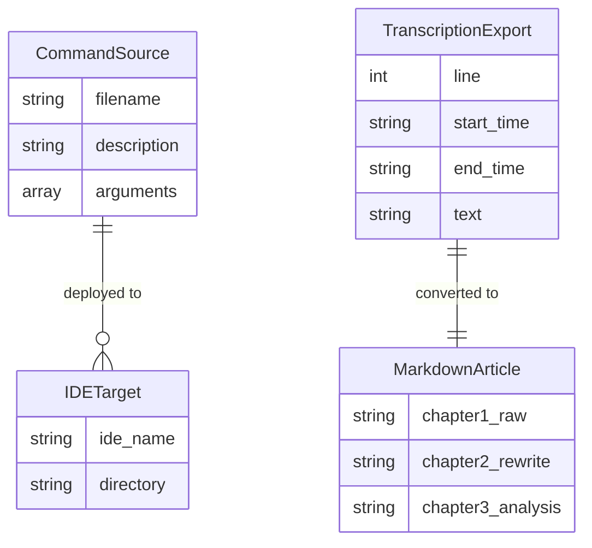

# Data Model: STT Command 拆分与 Skill 化重构

**Feature**: 004-stt-command-refactor
**Date**: 2026-04-01

## Entities

### CommandSource

Command 源文件，存放在 `commands/` 目录下。

| Field | Type | Description | Constraints |
|-------|------|-------------|-------------|
| filename | string | 文件名（含 `.md` 扩展名） | 格式: `stt.{name}.md`，kebab-case |
| description | string | frontmatter 中的命令描述 | 必填，中文 |
| arguments | array | frontmatter 中的参数定义 | 可选 |
| body | string | Markdown 正文（prompt 内容） | 必填 |

**Validation**:
- 文件必须以 `---` 开头的 YAML frontmatter
- frontmatter 中 MUST NOT 包含 `model` 字段
- 文件编码 MUST 为 UTF-8

### TranscriptionExport (已有)

stt 服务导出的 JSON 转录结果，沿用 002 spec 中的定义。

| Field | Type | Description | Constraints |
|-------|------|-------------|-------------|
| line | int | 行号 | > 0 |
| start_time | string | 开始时间 | SRT 格式: `HH:MM:SS,mmm` |
| end_time | string | 结束时间 | SRT 格式: `HH:MM:SS,mmm` |
| text | string | 转录文本 | 非空 |

### MarkdownArticle

最终输出的 Markdown 演讲稿文件。

| Section | Generator | Heading Level | Description |
|---------|-----------|---------------|-------------|
| 元数据头 | json2md.py | H1 + metadata | 标题、Source、Segments、Duration |
| 第一章：原文 | json2md.py | H2 | 段落合并后的原始转录文本 |
| 第二章：AI 重写 | stt.json2md (AI) | H2 | AI 重写稿（含 H3 子标题、标点、引用块） |
| 第三章：内容分析 | stt.summarize (AI) | H2 | AI 内容分析报告（主题、核心观点等） |

**State Transitions**:

### IDETarget

setup-commands.ps1 的部署目标。

| IDE | Directory | Format |
|-----|-----------|--------|
| codebuddy | `.codebuddy/commands/` | frontmatter + Markdown |
| cursor | `.cursor/commands/` | frontmatter + Markdown |

## Relationships

