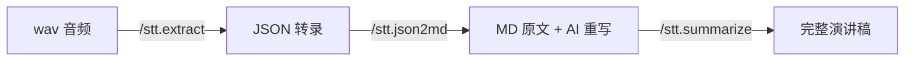

# Quickstart: STT Command 拆分与 Skill 化重构

**Feature**: 004-stt-command-refactor
**Branch**: `004-stt-command-refactor`

## 前置条件

- Python 3.9+
- Windows (PowerShell)
- stt-Voice2Text 项目已 clone

## 快速开始

### 1. 部署 AI Commands（Skill 一键配置）

```powershell
.\scripts\setup-commands.ps1
```

部署到 Cursor：
```powershell
.\scripts\setup-commands.ps1 -IDE cursor
```

同时部署到两个 IDE：
```powershell
.\scripts\setup-commands.ps1 -IDE codebuddy,cursor
```

### 2. 完整工作流（音频 → 演讲稿）



#### Step 1: 提取音频转录（可选，也可通过 Web UI）

在 IDE 中执行：
```
/stt.extract static/tmp/audio.wav
```

AI 会自动检测 stt 服务状态，未运行时自动启动。

#### Step 2: JSON 转 Markdown + AI 重写

```
/stt.json2md Export/audio.json
```

自动完成：
1. 运行 `json2md.py` 生成第一章（原文）
2. AI 阅读原文，生成第二章（AI 重写稿）

#### Step 3: AI 内容总结

```
/stt.summarize Export/audio.md
```

AI 分析内容，追加第三章（内容分析）。

### 3. 新增自定义 Command

1. 在 `commands/` 目录下创建 `.md` 文件
2. 重新运行 `.\scripts\setup-commands.ps1`
3. 在 IDE 中即可使用新命令

## 文件结构

```
stt-Voice2Text/
├── commands/                    # Command 源文件（Git 追踪）
│   ├── stt.extract.md          # 音频提取命令
│   ├── stt.json2md.md          # JSON→MD + AI 重写命令
│   └── stt.summarize.md        # AI 总结命令
├── scripts/
│   └── setup-commands.ps1      # 一键配置脚本
├── tools/
│   └── json2md.py              # JSON→MD 转换脚本（已有）
├── Export/                      # 输出目录
│   ├── audio.json              # stt.extract 输出
│   └── audio.md                # stt.json2md + stt.summarize 输出
├── .codebuddy/commands/         # ← 脚本部署（.gitignore 忽略）
└── .cursor/commands/            # ← 脚本部署（.gitignore 忽略）
```

## 验证

| 检查项 | 命令 |
|--------|------|
| Commands 已部署 | 在 IDE 中输入 `/stt.` 查看命令列表 |
| json2md.py 可用 | `python tools/json2md.py --help` |
| stt 服务可用 | 浏览器访问 `http://127.0.0.1:9977` |
