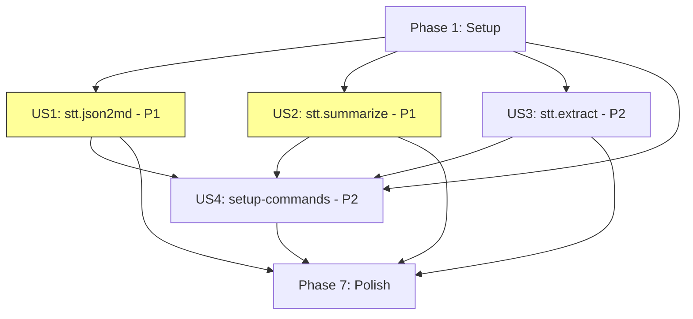

# Tasks: STT Command 拆分与 Skill 化重构

**Input**: Design documents from `/specs/004-stt-command-refactor/`
**Prerequisites**: plan.md ✅, spec.md ✅, research.md ✅, data-model.md ✅, contracts/ ✅, quickstart.md ✅

**Tests**: Not requested — spec 中未要求 TDD，仅通过 smoke test 验证（Constitution Principle V）。

**Organization**: Tasks are grouped by user story to enable independent implementation and testing of each story.

## Format: `[ID] [P?] [Story] Description`

- **[P]**: Can run in parallel (different files, no dependencies)
- **[Story]**: Which user story this task belongs to (e.g., US1, US2, US3, US4)
- Include exact file paths in descriptions

---

## Phase 1: Setup (Shared Infrastructure)

**Purpose**: 项目目录结构初始化，确保 `commands/` 和 `scripts/` 目录就绪

- [x] T001 创建 `commands/` 源目录 at `commands/`
- [x] T002 [P] 创建 `scripts/` 目录 at `scripts/`（如不存在）
- [x] T003 [P] 更新 `.gitignore`：验证 `.codebuddy/` 已忽略 + 添加 `.cursor/` 忽略规则 + 确认 `commands/` 不被忽略 at `.gitignore`

**Checkpoint**: 目录结构就绪，.gitignore 配置正确

---

## Phase 2: Foundational (Blocking Prerequisites)

**Purpose**: 无额外基础设施需求 — 本项目为纯文件创建（Markdown + PowerShell），无需数据库、框架初始化等前置工作。

**⚠️ 说明**: 本项目的"基础设施"即 Phase 1 的目录结构。Phase 1 完成后，所有 User Story 可立即开始。

---

## Phase 3: User Story 1 — stt.json2md (Priority: P1) 🎯 MVP

**Goal**: 提供 `/stt.json2md` 命令，先调用 `json2md.py` 生成第一章原文，然后 AI 自动追加第二章 AI 重写稿（含子标题分配、标点补充、对话性内容检测）

**Independent Test**: 在 IDE 中执行 `/stt.json2md Export/audio.json`，验证生成的 MD 文件包含第一章原文和第二章 AI 重写稿

### Implementation for User Story 1

- [x] T004 [US1] 创建 `stt.json2md.md` 的 frontmatter（description + arguments）at `commands/stt.json2md.md`
  - frontmatter 中 MUST NOT 包含 `model` 字段（R1）
  - arguments: `json-file-path`（required: true）
- [x] T005 [US1] 编写 stt.json2md 的 Step 1 prompt：输入验证与脚本调用指令 at `commands/stt.json2md.md`
  - 验证 JSON 文件存在且格式有效
  - 验证 JSON 文件编码为 UTF-8（非 UTF-8 时 ABORT 并提示编码问题）
  - 调用 `python tools/json2md.py "{json-file-path}" -f`
  - 检查退出码，失败时 ABORT
- [x] T006 [US1] 编写 stt.json2md 的 Step 2 prompt：AI 重写指令 at `commands/stt.json2md.md`
  - AI 读取生成的 MD 文件
  - 子标题分配规则：`###` 三级标题，内容概括式命名，不带编号
  - 标点补充规则：补充句号、逗号、问号等
  - 对话性内容检测：互动性内容使用 `>` 引用块标注
  - 风格保持：保持口语自然风格，不过度书面化
  - 信息完整性：保留原文 ≥ 95% 核心信息点
- [x] T007 [US1] 编写 stt.json2md 的幂等性与渐进式加载指令 at `commands/stt.json2md.md`
  - 已存在 `## 第二章：AI 重写` 时，删除后重新生成
  - 原文 > 20000 tokens 时分段重写后合并（FR-009）
- [x] T008 [US1] 编写 stt.json2md 的输出格式规范 at `commands/stt.json2md.md`
  - 输出标题：`## 第二章：AI 重写`
  - 追加到已有 MD 文件末尾（`---` 分隔符后）
  - 完成后输出确认报告（包含：输出文件路径、第一章段落数、第二章子标题数）

**Checkpoint**: `/stt.json2md` 命令可独立使用，生成包含第一章 + 第二章的完整 MD 文件

---

## Phase 4: User Story 2 — stt.summarize (Priority: P1)

**Goal**: 提供 `/stt.summarize` 命令，对已有 MD 文件进行 AI 内容分析，追加第三章总结报告

**Independent Test**: 对已有的 MD 文件执行 `/stt.summarize Export/audio.md`，验证第三章包含主题和核心观点

### Implementation for User Story 2

- [x] T009 [US2] 创建 `stt.summarize.md` 的 frontmatter（description + arguments）at `commands/stt.summarize.md`
  - frontmatter 中 MUST NOT 包含 `model` 字段（R1）
  - arguments: `md-file-path`（required: true）
- [x] T010 [US2] 编写 stt.summarize 的前置验证 prompt at `commands/stt.summarize.md`
  - 验证 MD 文件存在
  - 验证包含 `## 第一章：原文` 和 `## 第二章：AI 重写` 标题
  - 缺少时 ABORT 并提示先运行 `/stt.json2md`
- [x] T011 [US2] 编写 stt.summarize 的内容分析 prompt at `commands/stt.summarize.md`
  - 必选章节：主题、核心观点
  - 可选章节：论据与案例、关键数据、争议与反思、行动建议、关键引用、概念解释、时间线/流程
  - Token 估算 + 渐进式加载策略（> 6000 tokens 时分段分析）
- [x] T012 [US2] 编写 stt.summarize 的幂等性与输出格式指令 at `commands/stt.summarize.md`
  - 已存在 `## 第三章：内容分析` 时，删除后重新生成
  - 输出标题：`## 第三章：内容分析`
  - 追加到文件末尾（`---` 分隔符后）

**Checkpoint**: `/stt.summarize` 命令可独立使用，在已有第一章 + 第二章的 MD 文件上追加第三章

---

## Phase 5: User Story 3 — stt.extract (Priority: P2)

**Goal**: 提供 `/stt.extract` 命令，引导用户从 wav 音频文件提取 JSON 转录结果，含服务自动检测与启动

**Independent Test**: 在 IDE 中执行 `/stt.extract static/tmp/audio.wav`，验证系统能检测服务状态并引导完成 JSON 提取

### Implementation for User Story 3

- [x] T013 [US3] 创建 `stt.extract.md` 的 frontmatter（description + arguments）at `commands/stt.extract.md`
  - frontmatter 中 MUST NOT 包含 `model` 字段（R1）
  - arguments: `audio-file-path`（required: true）
- [x] T014 [US3] 编写 stt.extract 的输入验证 prompt at `commands/stt.extract.md`
  - 验证音频文件存在
  - 非 wav 格式时提示通过 Web UI 转换
  - 文件 > 500MB 时提示分段处理
- [x] T015 [US3] 编写 stt.extract 的服务检测与自动启动 prompt at `commands/stt.extract.md`
  - HTTP GET 检测 `http://127.0.0.1:9977`
  - 未运行时自动执行 `python start.py`
  - 轮询等待（最多 60s，间隔 5s）
  - 超时或启动失败时降级提示用户手动处理（含端口被占用场景的诊断提示）
- [x] T016 [US3] 编写 stt.extract 的 API 调用与结果保存 prompt at `commands/stt.extract.md`
  - POST `/api` 提交音频文件（multipart/form-data，字段名 `file`）；`/api` 为首选端点，`/v1/audio/transcriptions` 为备选
  - 保存 JSON 结果到 `Export/{stem}.json`
  - 完成后输出确认报告

**Checkpoint**: `/stt.extract` 命令可独立使用，完成从音频到 JSON 的全流程

---

## Phase 6: User Story 4 — setup-commands (Priority: P2)

**Goal**: 提供 `setup-commands.ps1` 一键配置脚本，将 `commands/` 下的 AI Command 部署到目标 IDE 目录

**Independent Test**: 运行 `.\scripts\setup-commands.ps1`，验证 `.codebuddy/commands/` 下出现所有 Command 文件

### Implementation for User Story 4

- [x] T017 [US4] 创建 `setup-commands.ps1` 脚本框架：参数定义与帮助信息 at `scripts/setup-commands.ps1`
  - 脚本头部注释块（Synopsis、Description、Parameters、Examples）
  - `-IDE` 参数（string，默认 `codebuddy`，支持逗号分隔多选）
  - 帮助信息（`-Help` 开关）
- [x] T018 [US4] 实现 `setup-commands.ps1` 核心逻辑：扫描、验证、复制 at `scripts/setup-commands.ps1`
  - 扫描 `commands/*.md`
  - 空目录时提示并退出（exit code 0 + 提示信息，非错误退出）
  - 解析 `-IDE` 参数，映射到目标目录
  - 创建目标目录（如不存在）+ 复制文件（覆盖模式）
  - 输出部署报告（文件数、目标路径）
  - 非 Windows 环境检测：提示使用 `setup-commands.sh`（如果存在）或手动复制

**Checkpoint**: `setup-commands.ps1` 可独立运行，正确部署 Command 文件到目标 IDE 目录

---

## Phase 7: Polish & Cross-Cutting Concerns

**Purpose**: 跨 User Story 的收尾工作

- [x] T019 [P] 验证三命令串联工作流：`stt.extract → stt.json2md → stt.summarize`（SC-005 smoke test）
- [x] T020 [P] 验证 `setup-commands.ps1` 部署后三个命令在 IDE 中可见并可执行
- [x] T021 运行 quickstart.md 中的验证步骤，确认所有检查项通过

**Checkpoint**: 所有功能完整，串联工作流验证通过

---

## Dependencies & Execution Order

### Phase Dependencies

- **Setup (Phase 1)**: 无依赖 — 可立即开始
- **Foundational (Phase 2)**: 无实质任务 — 跳过
- **US1 stt.json2md (Phase 3)**: 依赖 Phase 1（`commands/` 目录存在）
- **US2 stt.summarize (Phase 4)**: 依赖 Phase 1（`commands/` 目录存在）
- **US3 stt.extract (Phase 5)**: 依赖 Phase 1（`commands/` 目录存在）
- **US4 setup-commands (Phase 6)**: 依赖 Phase 1（`scripts/` 目录存在）+ Phase 3~5（至少有一个 Command 文件可部署）
- **Polish (Phase 7)**: 依赖 Phase 3~6 全部完成

### User Story Dependencies



- **US1 (P1)**: Phase 1 完成后可立即开始 — 无其他 Story 依赖
- **US2 (P1)**: Phase 1 完成后可立即开始 — 无其他 Story 依赖（运行时依赖 US1 的输出文件，但开发时独立）
- **US3 (P2)**: Phase 1 完成后可立即开始 — 无其他 Story 依赖
- **US4 (P2)**: 依赖 US1~US3 至少部分完成（需要 `commands/` 下有文件可部署）

### Within Each User Story

- Frontmatter 先于 prompt body
- 输入验证先于核心逻辑
- 核心逻辑先于幂等性/输出格式
- 每个 Story 完成后可独立 smoke test

### Parallel Opportunities

- T001, T002, T003 可并行（不同文件）
- US1 (Phase 3) 和 US2 (Phase 4) 和 US3 (Phase 5) 可并行开发（不同文件，无依赖）
- T019, T020 可并行验证

---

## Parallel Example: Phase 3~5 并行

```text
# Phase 1 完成后，三个 User Story 可同时启动：

Developer A: US1 stt.json2md
  → T004 → T005 → T006 → T007 → T008

Developer B: US2 stt.summarize  
  → T009 → T010 → T011 → T012

Developer C: US3 stt.extract
  → T013 → T014 → T015 → T016

# 三个 Story 完成后：
Developer A: US4 setup-commands
  → T017 → T018
```

---

## Implementation Strategy

### MVP First (User Story 1 Only)

1. Complete Phase 1: Setup（T001~T003）
2. Complete Phase 3: US1 stt.json2md（T004~T008）
3. **STOP and VALIDATE**: 在 IDE 中执行 `/stt.json2md` 验证第一章 + 第二章生成
4. 这是最小可用产品 — 用户已可完成核心的 JSON→MD+AI 重写工作流

### Incremental Delivery

1. Setup → US1 stt.json2md → **Validate**（MVP!）
2. + US2 stt.summarize → **Validate**（完整的内容分析流程）
3. + US3 stt.extract → **Validate**（端到端音频→演讲稿流程）
4. + US4 setup-commands → **Validate**（Skill 化部署能力）
5. Polish → 串联验证 → **Done**

### Single Developer Strategy（推荐）

按优先级顺序逐个完成：
1. Phase 1 → Phase 3 (US1) → Phase 4 (US2) → Phase 5 (US3) → Phase 6 (US4) → Phase 7

---

## Notes

- 本项目为 Markdown-driven prompt engineering + PowerShell 脚本，无传统代码编译/构建步骤
- 每个 Command MD 文件是一个完整的 AI prompt，需要精心编写以确保 AI 行为一致
- `tools/json2md.py` 和 `start.py` 为已有上游文件，MUST NOT 修改（Constitution Principle I）
- 现有 `jsonvoice2md.md` 保留不删除（Constitution Principle III: Backward Compatibility）
- 所有新文件 MUST 使用 UTF-8 编码
- Commit 建议：每完成一个 Phase 提交一次
